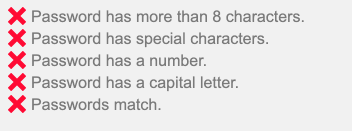

# React Password Checklist

[](https://www.npmjs.com/package/react-password-checklist)   
<br /> [](https://app.travis-ci.com/github/sators/react-password-checklist) [](https://coveralls.io/github/sators/react-password-checklist?branch=master) [](https://github.com/sators/react-password-checklist/issues) [](https://github.com/sators/react-password-checklist/pulls) [](https://twitter.com/sators)

A React Component to display the success or failure of password strength rules that updates as a user types.

## Example



## Install in your project

`npm install --save react-password-checklist`

`yarn add react-password-checklist`

_Note: react is a peer dependency. You should be using this in a React project._

## Example Usage

```
import React, {useState} from "react"
import PasswordChecklist from "react-password-checklist"

const SignUp = () => {
	const [password, setPassword] = useState("")
	const [passwordAgain, setPasswordAgain] = useState("")
	return (
		<form>
			<label>Password:</label>
			<input type="password" onChange={e => setPassword(e.target.value)}>
			<label>Password Again:</label>
			<input type="password" onChange={e => setPasswordAgain(e.target.value)}>

			<PasswordChecklist
				rules={["minLength","specialChar","number","capital","match"]}
				minLength={5}
				value={password}
				valueAgain={passwordAgain}
				onChange={(isValid) => {}}
			/>
		</form>
	)
}
```

### Custom Messages/Translations

```
import React, {useState} from "react"
import PasswordChecklist from "react-password-checklist"

const SignUp = () => {
	const [password, setPassword] = useState("")
	const [passwordAgain, setPasswordAgain] = useState("")
	return (
		<form>
			<label>Password:</label>
			<input type="password" onChange={e => setPassword(e.target.value)}>
			<label>Password Again:</label>
			<input type="password" onChange={e => setPasswordAgain(e.target.value)}>

			<PasswordChecklist
				rules={["minLength","specialChar","number","capital","match"]}
				minLength={8}
				value={password}
				valueAgain={passwordAgain}
				messages={{
					minLength: "La contraseña tiene más de 8 caracteres.",
					specialChar: "La contraseña tiene caracteres especiales.",
					number: "La contraseña tiene un número.",
					capital: "La contraseña tiene una letra mayúscula.",
					match: "Las contraseñas coinciden.",
				}}
			/>
		</form>
	)
}
```

## Available Rules

Customize the component to display only the rules you need in the desired order you wish to display them.

#### minLength

Valid if the password meets the minimum length. Requires `minLength` prop to be included.

#### maxLength

Valid if the password meets the maximum length. Requires `maxLength` prop to be included.

#### specialChar

Valid if the password contains a special character from [this list](https://github.com/sators/react-password-checklist/blob/master/src/index.tsx#L60).

#### number

Valid if the password contains a number.

#### capital

Valid if the password contains a capital letter.

#### match

Valid if the password matches the confirm password valid. Requires `valueAgain` prop to be included.

#### letter

Valid if the password contains a letter (capital or lowercase)

#### lowercase

Valid if the password contains a lowercase letter

#### notEmpty

Valid if the password and confirm passwords both contain any character. Requires `valueAgain` prop to be included.

#### capitalAndLowercase

Valid if the password contains both a capital letter and lowercase letter.

#### noSpaces

Valid if the password does not contain a space.

## Props

| Prop              | Description                                                                                                                                                                                                                               | Type     | Required                        | Default                                                       |
| ----------------- | ----------------------------------------------------------------------------------------------------------------------------------------------------------------------------------------------------------------------------------------- | -------- | ------------------------------- | ------------------------------------------------------------- |
| rules             | Rules to display in the order desired.<br />Options are `minLength`, `maxLength`, `specialChar`,<br />`number`, `letter`, `capital`, `match`, <br />`lowercase`, `notEmpty`, `capitalAndLowercase`, `noSpaces`                            | array    | yes                             |
| value             | Current potential password                                                                                                                                                                                                                | string   | yes                             |
| valueAgain        | Current potential password confirmation                                                                                                                                                                                                   | string   | Only with<br />`match` rule     |
| minLength         | Minimum Password Length                                                                                                                                                                                                                   | number   | Only with<br />`minLength` rule |
| maxLength         | Maximum Password Length                                                                                                                                                                                                                   | number   | Only with<br />`maxLength` rule |
| specialCharsRegex | Regular expression to be used to validate the specialChars rule                                                                                                                                                                           | RegExp   |                                 | `` /[~`¿¡!#$%\^&*€£@+÷=\-\[\]\\';,/{}\(\)\|\\":<>\?\.\_]/g `` |
| onChange          | Callback that is triggered when the<br />validity of any rule changes.                                                                                                                                                                    | function |                                 | `(isValid: boolean, failedRules: string[]) => {}`             |
| messages          | Object with keys as rules, and values as strings to use as the message to be displayed                                                                                                                                                    | object   |                                 |
| className         | Class applied to the entire component                                                                                                                                                                                                     | string   |                                 |
| rtl               | apply rtl styles                                                                                                                                                                                                                          | boolean  |                                 | false                                                         |
| hideIcon          | Remove the SVG icon element                                                                                                                                                                                                               | boolean  |                                 | false                                                         |
| style             | Inline styles applied to the<br />outer component wrapper                                                                                                                                                                                 | object   |                                 |
| iconSize          | Size of ✔ or 𐄂 icon                                                                                                                                                                                                                       | number   |                                 | `18`                                                          |
| validTextColor    | Color of valid text                                                                                                                                                                                                                       | string   |                                 | Inherited color                                               |
| invalidTextColor  | Color of invalid text                                                                                                                                                                                                                     | string   |                                 | Inherited color opacity 0.5                                   |
| validColor        | Color of checkmark icon. Not used with custom `iconComponents`                                                                                                                                                                            | string   |                                 | `#4BCA81`                                                     |
| invalidColor      | Color of X icon. Not used with custom `iconComponents`                                                                                                                                                                                    | string   |                                 | `#FF0033`                                                     |
| iconComponents    | Optional object containing keys of `ValidIcon` and `InvalidIcon` with a React Node to be displayed in place of icon. Both icons required if used. Example: `{ValidIcon: , InvalidIcon: }` | object   |                                 |                                                               |

## Available Classes

- `.valid` - Valid Message
- `.invalid` - Invalid Message

## Contributing

PRs are welcome for additional functionality! See the Run Locally section below. Pull requests should include unit tests and potentially storybook stories to cover the updates. Thanks!

## Run Locally

`npm i` to install dependencies.

`npm run storybook`
